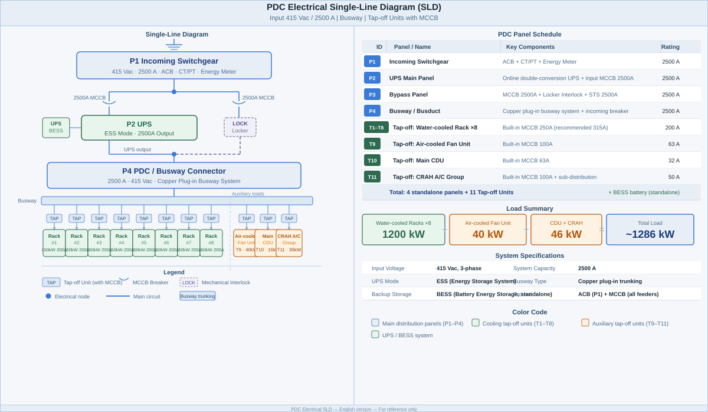

---
tags:
  - #workspace/engineer
  - #type/product
  - #product/dc45
---
# DC45 – PowerPod with Direct Liquid Cooling (45ft)

适用对象：MDC（Modular Datacenter Cluster）标准计算单元 IT Zone\
版本：V1.2（2026-05-09 更新：FCU 12台动态配置 + OEM机柜适配）

***

## 1. 产品定位

DC45 是 45ft 容器规格的直冷液冷（DLC）集装箱，支持 8 × 150kW DLC 机柜，适用于超大算力 AI 集群部署。

标准 IT 容量为 1240kW，支持与 AC40 混合构建 MDC 集群。

***

## 2. 核心参数

| 项目        | 参数                                                                   |
| --------- | -------------------------------------------------------------------- |
| **IT 总容量** | **1240kW**（8×150kW DLC + 1×40kW 风冷）                                                           |
| DLC 机柜    | 150kW                                                                |
| DLC 机柜数量  | 8                                                                    |
| 风冷机柜      | 40kW × 1                                                             |
| 服务器进口温度   | **26–28°C**（TCS 进水，CDU 二次侧供水至冷板）<!-- 原值: 24°C，2026-05-20 修订 --> |
| Busbar 规格 | SIEMENS 2500A                                                        |
| UPS       | EATON **9395XR-1500**，10 个功率模块（每模块 150kW），总功率 **1500kW**，发热量约 46.9kW |
| 电池        | 3 个 93LiG2 机柜，每柜 332kW，共提供 **8 分钟**后备时间                              |
| 主 CDU     | 1.2MW Rack CDU                                                       |
| 备用 CDU    | 150kW In-Rack CDU（可选）                                                |
| 功率因数      | 0.9（UPS 输出侧）                                                         |

> **注：** 9395XR-1500 中的"1500"= 10 × 150kW 模块，与 AC40 使用的 9395XR-600（4 模块）属同一产品系列。

***

## 3. IT负载 vs 整体电力负荷

| 项目         | 数值                                                         | 说明                                |
| ---------- | ---------------------------------------------------------- | --------------------------------- |
| **IT 负载**  | 1240kW                                                     | 服务器、GPU 实际消耗（DLC + 风冷）                    |
| **整体电力负荷** | ~1390–1670kW                                              | 取决于 PUE（PUE 约 1.12–1.35） |
| PUE 设计值    | **取决于环境温度**：• 低温区（干冷器优先）：~1.12–1.15• 高温区（DX 主导）：~1.25–1.35 | 不写固定数字                            |



**开关柜数量汇总：**

| 设备                       | 数量     | 备注                            |
| ------------------------ | ------ | ----------------------------- |
| 进线柜（Incoming Switchgear） | 1面     | 主断路器 / 电流互感器 / 计量             |
| UPS 主机柜                  | 1面     | 在线双变换，含静态旁路切换逻辑               |
| Bypass 旁路柜               | 1面     | 内含 MCCB + 机械 Locker（防止两路同时闭合） |
| 电池仓（BESS）                | 独立配置   | 按备用时间计算容量，通常 1–2 排            |
| 母线槽系统（2500A Busway）      | 1套     | 插接式母线槽，含端头馈线箱                 |
| Tap-off Unit — 水冷机柜      | **8台** | 每台约 200A，含 250A MCB           |
| Tap-off Unit — 风冷机柜      | 1台     | 约 80A，含 100A MCB               |
| Tap-off Unit — 主CDU      | 1台     | 约 25A，含 32A MCB               |
| Tap-off Unit — FCU空调组    | 1台     | 约 50A，含 63A MCB，6–8台FCU接子配电   |

***

## 4. 机柜详情

- 48U 标准机柜
- 侧置 Manifold（液冷歧管）
- 后置 PDU
- 机柜深度 1200mm，宽度 800mm
- 机柜后门离集装箱墙 350mm
- 前门保留足够运维空间
- 机柜底部 350–400mm 管路，配电区域无地板架高

### 4.1 布局图

| 视图 | 文件 |
|------|------|
| TOP（俯视图） | [[DC45 Layout/TOP.svg\|TOP — 俯视图]] |
| FRONT（正视图） | [[DC45 Layout/FRONT.svg\|FRONT — 正视图]] |
| SIDE（侧视图） | [[DC45 Layout/SIDE.svg\|SIDE — 侧视图]] |

***

## 5. 冷却架构

### 5.1 DLC 冷却部分

| 项目      | 参数                                                           |
| ------- | ------------------------------------------------------------ |
| 冷却方式    | Direct Liquid Cooling（冷板式液冷）                                 |
| 服务器进口温度 | **26–28°C**（TCS 进水，CDU 二次侧供水至冷板）<!-- 原值: 24°C，2026-05-20 修订 --> |
| CDU 配置  | 主 CDU 1.2MW Rack CDU × 1 + 可选 150kW In-Rack CDU              |
| 散热方式    | **Hybrid Cooling System**（干冷器 + DX 一体化）或 **热泵**              |
| **禁止**  | 纯干冷器（无 DX）— 环境 ≥28°C 时无法满足散热需求                               |
| 设计原则    | ‹WIKILINK:FOG/KB/Guideline/COOLING_SYSTEM_Guideline› |

### 5.2 FCU 散热部分

| 项目     | 参数                          |
| ------ | --------------------------- |
| FCU 模组数量 | **12 个**（根据环境温度动态调整）               |
| 单模组能力  | 40kW                        |
| 总散热能力  | **480kW**                   |
| 工作模式   | 低温区（<28°C）：部分 FCU 运行；高温区（≥28°C）：全载运行 |
| 出风温度   | 18–25°C（压缩机可加热/制冷）          |
| FCU 模组   | 带压缩机，可加热和制冷，确保 18–25°C 温度控制 |

> **注：** FCU 数量根据环境温度动态调整。低温环境可减少运行数量以节省能耗；高温环境需全载运行。详细电力分配和热力分析参见冷却计算工具：https://dc45-cooling-calc.pages.dev/

### 5.3 原厂 OEM 机柜适配

DC45 支持**不预装 DLC 机柜**，客户可后续自行安装原厂 OEM 机柜。

| 项目 | 参数 |
|------|------|
| 最大机柜宽度 | 800mm |
| 最大机柜深度 | 1200mm |
| 最大机柜高度 | 2300mm |
| 兼容品牌 | SMCI（超微）、HPE（慧与）、DELL（戴尔）、Lenovo（联想）等标准 19 英寸机柜 |
| 适配方式 | 预留液冷歧管（Manifold）接口和配电接口，支持后装 |

> **注意：** 原厂 OEM 机柜需自行确认与 DC45 液冷管路的兼容性。

### 5.4 水路冗余

- 2N 系统
- DC45 包含 1 个 1.2MW CDU
- 可在机柜内选配 150kW In-Rack CDU

***

## 6. 电力路径

```text
Grid / BESS → PDC → UPS (EATON 9395XR-1500) → PDC → Busbar
    → Tap-off Unit (TOU，带 MCCB) → DLC Racks → PDU
```

说明：

- UPS 内置于 DC45，提供约 8 分钟 UPS电池后备
- UPS电池：3×93LiG2，内置于 DC45（与 BESS 电池完全不同）
- Busbar 采用 SIEMENS 2500A 封闭式母线
- TOU 每路 250A 为单机柜供电
- BESS 连接方式：Grid → BESS → DC45（Power Zone 负责）

***

## 7. 冗余说明

> ⚠️ **重要区分：UPS 模块冗余 vs IT Zone 容器冗余**

| 层级                    | 冗余描述                                         |
| --------------------- | -------------------------------------------- |
| **UPS 模块**            | 9395XR-1500 内置 10 个功率模块，支持内部 N+1（单模块故障不影响运行） |
| **CDU**               | 1.2MW 主 CDU + 可选 In-Rack CDU（可选 1+1 配置）      |
| **FCU**                | 12 台根据环境温度动态调整运行数量（部分 FCU 故障不影响整体）         |
| **IT Zone（DC45 集装箱）** | **无内部冗余** — 单台 DC45 独立运行，不含内部 N+1/2N         |
| **MDC 系统级**           | 多台 DC45 并联 → 系统级冗余（N / N+1 / 2N 由集装箱数量决定）    |
| **OEM 机柜**            | 客户自备机柜无内置冗余，需通过系统级 MDC 冗余实现高可用          |

> DC45 是一台完整的集装箱设备，不存在"多增加几个服务器"来增加冗余的概念。\
> 如需更高可靠性，通过增加 DC45 集装箱数量实现。

***

## 8. 扩展逻辑

- 可与 AC40 混合构建 MDC
- 支持横向扩展（增加 DC45 数量）
- 支持纵向扩展（单柜功率密度提升，但需重新评估 CDU 容量）

***

## 9. 交付周期

| 阶段 | 周期 | 说明 |
|------|------|------|
| 场地勘测 Site Survey | 2 周 | 现场条件评估 |
| 方案设计 Engineering | 2 周 | 技术方案确认 |
| 生产制造 Manufacturing | 16–20 周 | 集装箱制造 + 设备集成 |
| 运输报关 Logistics | 35–60 天 | 海运 + 清关 |
| 安装部署 Installation | 30 天 | 现场安装 + 调试 |
| **总周期** | **~195–305 天** | 合同签署后起算 |

***

## 10. UPS 型号说明

| 产品       | UPS 型号            | 模块数    | 每模块   | 总 UPS 功率 | 发热量     | UPS 放置          | UPS 电池后备时间            |
| -------- | ----------------- | ------ | ----- | -------- | ------- | --------------- | --------------------- |
| **AC40** | EATON 9395XR-600  | 4 UPM  | 150kW | 600kW    | ~7.9kW  | **外置（客户自备）**    | ~10 分钟（客户自备 2×93LiG2） |
| **AC45** | EATON 9395XR-600  | 4 UPM  | 150kW | 600kW    | ~7.9kW  | 内置（专用电力舱），UL 合规 | ~20 分钟（内置 2×93LiG2）   |
| **DC45** | EATON 9395XR-1500 | 10 UPM | 150kW | 1500kW   | ~46.9kW | 内置，UL 合规        | ~8 分钟（内置 3×93LiG2）    |

> ⚠️ **UPS 电池 vs BESS 电池：** 上表中"UPS电池后备"指 UPS 配套的 93LiG2 磷酸铁锂电池柜（分钟级瞬时切换后备）。BESS（如 Tesla Megapack / 国轩）是独立大型储能系统（小时级供电），两者完全不同。

UPS电池型号均为 **EATON 93LiG2**（93Li92S-100Ah-3PBFA，332kW/柜）。\
参考：[[UPS_EATON_9395XR|KB/UPS_EATON_9395XR]]

***

*Document Version: V1.2 | Last Updated: 2026-05-09*
